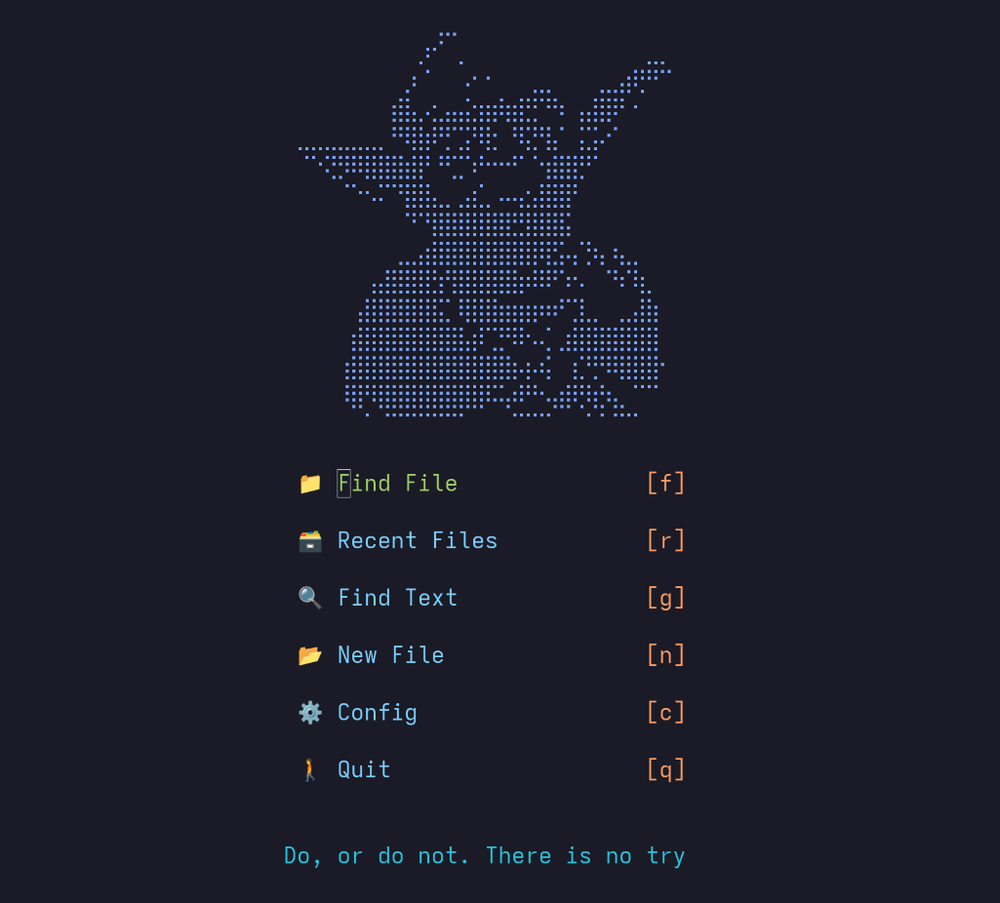

# My NeoVim Configuration

Built with the [kickstart](https://github.com/nvim-lua/kickstart.nvim) scaffolding.

[View the kickstart README](KICKSTART.md)

## Things I've added

  - [dashboard-nvim](https://github.com/nvimdev/dashboard-nvim)
  - [auto-save](https://github.com/pocco81/auto-save.nvim)
